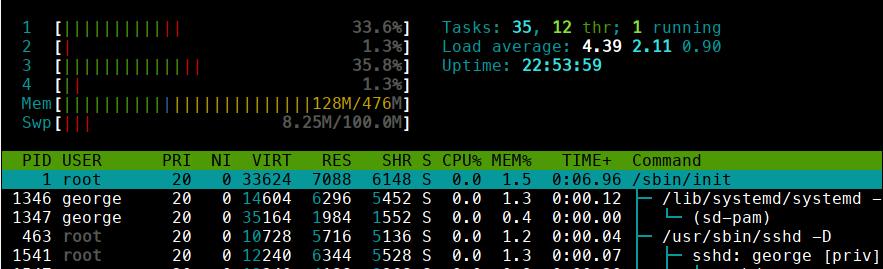
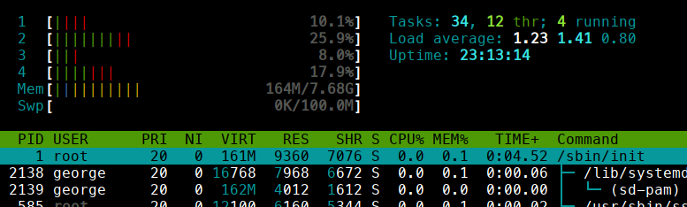
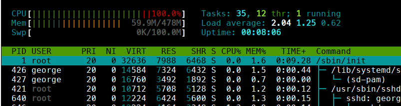

# rfsoapyfile

A Python 3 script for capturing and recording a SDR stream to a WAV file, or serving it as a HTTP audio stream.
The script is threaded for high performance, especially
on a Raspberry Pi.  The script includes a REST API
for controlling the capture and WAV recording remotely.

The script will save the WAV stream in either the RF64 or WAV(32) file format.
By default the recording is saved in the WAV(32) format using 32-bit IEEE floating point PCM samples.
To save using 16-bit PCM samples use the --pcm16 option.
The SDR specific 'auxi' 
metadata chunk, with record time and center frequency information, is added to the WAV audio file as well.

To quit the script and close the recording type control-C, or use the /quit REST call.


## Dependencies

The script requires the numpy and SoapySDR Python libraries.

## Example

```
$ soapyfile -f 100.1e6 -r 1e6 --pcm16 -g 42 --output out
```

## Installation

Either 

1) copy the file 'soapyfile/soapyfile.py' to where ever you want it
and then execute it directly using "python soapyfile.py" or 

2) install soapyfile using pip.  Specifically, cd into the directory where you cloned this repository, and then run "pip install .", note the dot.
Or you can use "pip install git+https://github.com/roseengineering/rfsoapyfile".  Now you can run "soapyfile" as a normal command in the shell.


## Usage


```
$ soapyfile --help
usage: soapyfile [-h] [-l] [-d DEVICE] [-f FREQUENCY] [-r RATE] [-g GAIN]
                    [-a] [--iq-swap] [--biastee] [--digital-agc]
                    [--offset-tune] [--direct-samp DIRECT_SAMP]
                    [--output OUTPUT] [--pause] [--pcm16] [--cf32] [--rf64]
                    [--notimestamp] [--packet-size PACKET_SIZE]
                    [--buffer-size BUFFER_SIZE] [--bins BINS] [--rbw RBW]
                    [--integration INTEGRATION] [--average AVERAGE]
                    [--hostname HOSTNAME] [--port PORT] [--waterfall]
                    [--meter] [--refresh REFRESH]

options:
  -h, --help            show this help message and exit
  -l, --list            list available device names (default: False)
  -d DEVICE, --device DEVICE
                        device string, eg. driver=rtlsdr (default: None)

device options:
  -f FREQUENCY, --frequency FREQUENCY
                        center frequency (Hz) (default: None)
  -r RATE, --rate RATE  sampling rate (Hz) (default: None)
  -g GAIN, --gain GAIN  front end gain (dB) (default: None)
  -a, --agc             enable AGC (default: False)
  --iq-swap             swap IQ signals (default: False)
  --biastee             enable bias tee (default: False)
  --digital-agc         enable digital AGC (default: False)
  --offset-tune         enable offset tune (default: False)
  --direct-samp DIRECT_SAMP
                        select I or Q channel: 1 or 2 (default: None)

output file options:
  --output OUTPUT       output file name (default: output)
  --pause               no file output until unpaused (default: False)
  --pcm16               write 16-bit PCM samples for WAV (default: False)
  --cf32                write as .c32 raw file rather than WAV (default:
                        False)
  --rf64                write RF64 file for WAV (default: False)
  --notimestamp         no timestamp appended file name (default: False)

streaming options:
  --packet-size PACKET_SIZE
                        soapysdr packet size in bytes (default: 1024)
  --buffer-size BUFFER_SIZE
                        stream buffer size in MB (default: 256)

power measurement options:
  --bins BINS           size of the fft to use (default: 64)
  --rbw RBW             resolution bandwidth (Hz), overrides bins (default:
                        None)
  --integration INTEGRATION
                        integration time for rbw option (default: 1)
  --average AVERAGE     number of ffts to average, overrides integration
                        (default: None)

REST server options:
  --hostname HOSTNAME   REST server hostname (default: 0.0.0.0)
  --port PORT           REST server port number (default: 8080)

console options:
  --waterfall           show a streaming ascii waterfall (default: False)
  --meter               show streaming peak values in dBFS (default: False)
  --refresh REFRESH     peak meter refresh (sec) (default: 1)
```


## REST API

The REST API is available off port 8080.  Use POST or PUT to change
a program or radio setting.  Use GET to view it.  If a boolean is needed, the following
strings are accepted: y, n, yes, no, true, and false.  Pausing the recording closes the WAV output file, while unpausing the recording creates
a new output file.   If the option --notimestamp is enabled, this means any previously existing
output file of the same name will be overwritten.
Also, the SDR stream is always being captured even when the recording is paused.

The IQ data is streamed out of URL paths /pcm, /float, and /cf32.
The /pcm endpoint streams 16 bit integer WAV.  The /float endpoint streams 32-bit
float WAV.  While the /cf32 endpoint streams in raw cf32 format.  Run soapyfile with the --pause option if
you only want to stream over HTTP.  (No SDR program that I know of currently supports HTTP streams,
however it might be useful for remote operation or sharing a stream in real time.)

Peak sample data (dBFS) and frequency power data (rtl_power output format) is streamed out of URL paths /peak and /power as text.

```
PUT /quit              <bool>      stop capture and terminate program, yes or no
PUT /rate              <float>     set sampling rate (Hz), if recording paused
PUT /frequency         <float>     set center frequency (Hz)
PUT /gain              <float>     set gain (dB)
PUT /agc               <bool>      enable agc, yes or no
PUT /pause             <bool>      pause the file recording, yes or no
PUT /setting/<name>    <string>    change named soapy SDR setting

GET /rate              return sampling rate (Hz)
GET /frequency         return center frequency (Hz)
GET /gain              return gain (Hz)
GET /agc               return AGC setting (bool)
GET /pause             return whether the file recording is paused (bool)
GET /setting           return a list of the available SDR soapy settings and their values
GET /setting/<name>    return the value of the named soapy SDR setting

GET /pcm               return a 16-bit integer PCM WAV HTTP audio stream
GET /float             return a 32-bit IEEE floating point WAV HTTP audio stream
GET /cf32              return a 32-bit IEEE floating point raw "cf32" HTTP audio stream
GET /peak              return latest ADC peak values (dBFS) as a HTTP stream
GET /power             return power values (dB) as a HTTP stream in rtl_power output format
```

Here are some sample curl commands:

```
curl localhost:8080/float --output out.wav
curl -d yes localhost:8080/agc
curl -d y localhost:8080/quit
curl -d n localhost:8080/pause
curl -d true localhost:8080/pause
curl -d 40.1 localhost:8080/gain
curl -d 100e6 localhost:8080/frequency
curl localhost:8080/pause
curl localhost:8080/agc
curl localhost:8080/gain
curl localhost:8080/peak
curl localhost:8080/frequency
```

For example, running the following curl commands I get:

```
$ curl -d 103e6 localhost:8080/frequency
OK
$ curl localhost:8080/frequency
103000000
```

```
$ curl -s localhost:8080/setting
sample_offset: "0"
rig: "0"
rig_rate: "0"
rig_port: ""
```

```
$ curl -i localhost:8080/float 
HTTP/1.1 200 OK
Server: BaseHTTP/0.6 Python/3.12.5
Date: Sun, 01 Sep 2024 15:08:34 GMT
Transfer-Encoding: chunked
Content-Disposition: inline; filename="10000000_48000_240901150834.wav"
Content-Type: audio/wav

Warning: Binary output can mess up your terminal. Use "--output -" to tell 
Warning: curl to output it to your terminal anyway, or consider "--output 
Warning: <FILE>" to save to a file.

$ curl -i localhost:8080/cf32
HTTP/1.1 200 OK
Server: BaseHTTP/0.6 Python/3.12.5
Date: Sun, 01 Sep 2024 15:08:38 GMT
Transfer-Encoding: chunked
Content-Disposition: inline; filename="10000000_48000_240901150838.cf32"
Content-Type: audio/cf32

Warning: Binary output can mess up your terminal. Use "--output -" to tell 
Warning: curl to output it to your terminal anyway, or consider "--output 
Warning: <FILE>" to save to a file.
```

## Benchmarks

My Raspberry Pi 3A+ is able to support up to a 1.5M sample rate with the RTLSDR before it overflows.  Here is the core usage:



While my Raspberry Pi 4B is able to support up to a 2.0M sample rate with the RTLSDR.



The Raspberry Pi Zero W Version 1 only has one core, so threading does not help. The best
it could support was a 300K sampling rate.



Version 2 of the Zero has four cores, however I do not have one to test against.

## Notes

The script uses the threading library to provide multithreading.  Despite the GIL lock
using this library was much faster than using the multiprocessing library performance-wise.
The need to copy streaming data across process spaces was probably too much of a hit.


